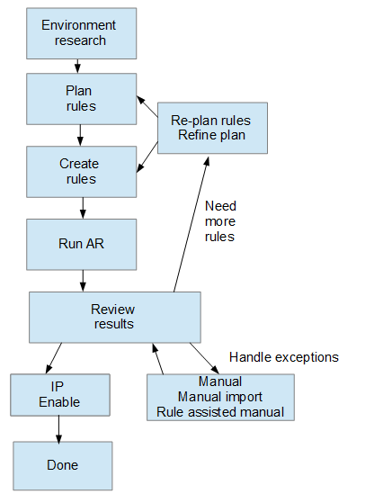

= Bevor Sie beginnen
:allow-uri-read: 
:icons: font
:imagesdir: ../media/

[role="lead"]
Sie müssen wissen, wie Ihre Umgebung konfiguriert ist, bevor Sie die Regeln für die Identifizierung von Geräten definieren. Je mehr Sie über Ihre Umgebung wissen, desto einfacher ist es, Geräte zu identifizieren.

Sie müssen die folgenden Fragen beantworten, um genaue Regeln zu erstellen:

* Gibt es in Ihrer Umgebung Namensstandards für Zonen oder Hosts, und wie viel Prozent dieser Standards sind korrekt?
* Verwendet Ihre Umgebung einen Switch-Alias oder Storage-Alias und stimmt mit dem Host-Namen überein?
* Verwendet Ihre Umgebung ein SRM-Tool, und können Sie es verwenden, um Hostnamen zu identifizieren? Welche Abdeckung bietet SRM?
* Wie oft ändern sich Benennungsschemata in Ihrer Umgebung?
* Gab es Übernahmen oder Fusionen, bei denen verschiedene Benennungsschemata eingeführt wurden?

Nach der Analyse Ihrer Umgebung sollten Sie in der Lage sein, zu identifizieren, welche Benennungsstandards existieren, die Sie mit der Zuverlässigkeit rechnen können. Die gesammelten Informationen können grafisch in einer Abbildung dargestellt werden, die der folgenden ähnelt:

image::../media/ar-workflow-circles.gif[ar-Workflow-Kreise]

In diesem Beispiel wird die größte Anzahl von Geräten zuverlässig durch Speicheraliasen dargestellt. Regeln, die Hosts mit Speicheraliasen identifizieren, sollten zuerst geschrieben werden, Regeln mit Switch-Aliasen sollten als Nächstes geschrieben werden, und die letzten erstellten Regeln sollten Zonenaliasen verwenden. Aufgrund der Überlappung der Verwendung von Zonen-Aliasen und Switch-Aliasen können einige Speicher-Alias-Regeln zusätzliche Geräte identifizieren, so dass weniger Regeln für Zonen-Aliase und Switch-Aliase erforderlich sind.

== Schritte zum Definieren von Geräten in Ihrer Umgebung

In der Regel würden Sie ähnliche Workflows wie die folgenden verwenden, um Geräte in Ihrer Umgebung zu identifizieren. Die Identifizierung ist ein iterativer Prozess und erfordert möglicherweise mehrere Schritte bei der Planung und Verfeinerung von Regeln.

[NOTE]
====
Wenn Sie in Ihrer Umgebung nicht identifizierte Geräte (auch bekannt als „`unknown`“ oder generische Geräte) haben und anschließend eine Datenquelle konfigurieren, die diese Geräte beim Abfragen identifiziert, werden diese nicht mehr als generische Geräte angezeigt oder gezählt.

====