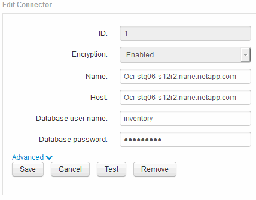

= Ändern der Passwörter „inventar“ und „dwh_internal“ mithilfe der Benutzeroberfläche für die Serververbindungskonfiguration
:allow-uri-read: 
:icons: font
:imagesdir: ../media/

[role="lead"]
Wenn Sie die Passwörter „`inventar`“ oder „`dwh_internal`“ so ändern müssen, dass sie mit denen auf dem Insight-Server übereinstimmen, verwenden Sie die Data Warehouse-Benutzeroberfläche.

== Bevor Sie beginnen

Sie müssen als Administrator angemeldet sein, um diese Aufgabe ausführen zu können.

== Schritte

. Melden Sie sich beim Data Warehouse Portal unter an https://hostname/dwh[], Wobei Hostname der Name des Systems ist, auf dem OnCommand Insight Data Warehouse installiert ist.
. Klicken Sie im Navigationsfenster auf der linken Seite auf *Connectors*.
+
Der Bildschirm *Connector bearbeiten* wird angezeigt.

+

. Geben Sie ein neues „`Inventory`“-Passwort für das Feld *Datenbankkennwort* ein.
. Klicken Sie Auf *Speichern*
. Um das Passwort „`dwh_internal`“ zu ändern, klicken Sie auf *Erweitert.*
+
Der Bildschirm Edit Connector Advanced wird angezeigt.

+
image::../media/dwh-password2.gif[dwh-Kennwort 2]

. Geben Sie das neue Passwort in das Feld *Server-Passwort* ein:
. Klicken Sie auf Speichern.

