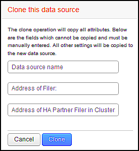

= Klonen einer Datenquelle
:allow-uri-read: 
:icons: font
:imagesdir: ../media/

[role="lead"]
Mit der Clone Facility können Sie schnell eine Datenquelle hinzufügen, die dieselben Anmeldedaten und Attribute wie eine andere Datenquelle enthält. Klonen ermöglicht Ihnen die einfache Konfiguration mehrerer Instanzen desselben Gerätetyps.

== Schritte

. Klicken Sie in der Insight-Symbolleiste auf *Admin*.
+
Die Liste Datenquellen wird geöffnet.

. Markieren Sie die Datenquelle mit den Setup-Informationen, die Sie für Ihre neue Datenquelle verwenden möchten.
. Klicken Sie rechts neben der markierten Datenquelle auf das Symbol *Clone*.
+
Im Dialogfeld „Diese Datenquelle klonen“ werden die Informationen aufgeführt, die Sie für die ausgewählte Datenquelle angeben müssen, wie in diesem Beispiel für eine NetApp Datenquelle dargestellt:

+

. Geben Sie die erforderlichen Informationen in die Felder ein. Diese Angaben können nicht aus der vorhandenen Datenquelle kopiert werden.
. Klicken Sie Auf *Clone*.

== Ergebnisse

Beim Klonvorgang werden alle anderen Attribute und Einstellungen kopiert, um die neue Datenquelle zu erstellen.
