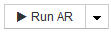

= Erstellen von Regeln für die Geräteauflösung
:allow-uri-read: 
:icons: font
:imagesdir: ../media/

[role="lead"]
Sie erstellen Regeln für die Geräteauflösung, um Hosts, Speicher und Bänder zu identifizieren, die derzeit von OnCommand Insight nicht automatisch erkannt werden. Die Regeln, die Sie erstellen, identifizieren Geräte, die sich derzeit in Ihrer Umgebung befinden, und identifizieren ähnliche Geräte, die Ihrer Umgebung hinzugefügt werden.

== Über diese Aufgabe

Wenn Sie Regeln erstellen, müssen Sie zunächst die Informationsquelle identifizieren, auf die die Regel angewendet wird, die Methode, mit der Informationen extrahiert werden sollen, und ob DNS-Suche auf die Ergebnisse der Regel angewendet wird.

|===

 a| 
Quelle, mit der das Gerät identifiziert wird

 a| 
* SRM-Aliase für Hosts
* Speicheralias, der einen eingebetteten Host- oder Bandnamen enthält
* Switch-Alias, der einen eingebetteten Host- oder Bandnamen enthält
* Zonennamen, die einen eingebetteten Hostnamen enthalten

 a| 
Methode, die zum Extrahieren des Gerätenamens aus der Quelle verwendet wird

 a| 
* Wie ist (extrahieren Sie einen Namen aus einem SRM)
* Trennzeichen
* Reguläre Ausdrücke

 a| 
DNS-Suche

 a| 
Gibt an, ob Sie DNS zur Überprüfung des Hostnamens verwenden.

|===
Sie erstellen Regeln auf der Registerkarte Regeln für die automatische Auflösung. Die folgenden Schritte beschreiben den Prozess zur Regelerstellung.

== Schritte

. Klicken Sie auf *Verwalten* > *Geräteauflösung*
. Klicken Sie auf der Registerkarte *Automatische Auflösungsregeln* auf *+Hinzufügen*
+
Der Bildschirm Neue Regel wird angezeigt.

+
[NOTE]
====
Der Bildschirm Neue Regel enthält ein *?*-Symbol, das Hilfe und Beispiele zum Erstellen regulärer Ausdrücke enthält.

====
. Wählen Sie in der Liste *Typ* das Gerät aus, das Sie identifizieren möchten.
+
Sie können Host oder Band auswählen.

. Wählen Sie in der Liste *Quelle* die Quelle aus, mit der Sie den Host identifizieren möchten.
+
Je nach gewählter Quelle zeigt Insight die folgende Antwort an:

+
** In Zonen sind die Zonen und WWN aufgeführt, die von Insight identifiziert werden müssen.
** SRM listet die nicht identifizierten Aliase auf, die von Insight identifiziert werden müssen
** Im Storage-Alias werden Storage-Aliase und WWN aufgeführt, die von Insight identifiziert werden müssen
** Switch-Alias listet die Switch-Aliase auf, die von Insight identifiziert werden müssen

. Wählen Sie in der Liste *Methode* die Methode aus, die Sie verwenden möchten, um den Host zu identifizieren.
+
|===

| Quelle | Methode 

 a| 
SRM
 a| 
„`as is`“, „`Trennzeichen`“, „`reguläre Ausdrücke`“

 a| 
Storage-Alias
 a| 
„`Trennzeichen`“ oder „`reguläre Ausdrücke`“

 a| 
Alias wechseln
 a| 
„`Trennzeichen`“ oder „`reguläre Ausdrücke`“

 a| 
Zonen
 a| 
„`Trennzeichen`“ oder „`reguläre Ausdrücke`“

|===
+
** Regeln, die „`Trennzeichen`“ verwenden, erfordern die Trennzeichen und die Mindestlänge des Hostnamens.
+
Die Mindestlänge des Hostnamens ist die Anzahl der Zeichen, die Insight zur Identifizierung eines Hosts verwenden sollte. Insight führt DNS-Suchvorgänge nur für Hostnamen aus, die so lang oder länger sind.

+
Bei Regeln, die Trennzeichen verwenden, wird die Eingabeszeichenfolge durch das Trennzeichen getokenisiert, und eine Liste von Hostnamenkandidaten wird durch das Erstellen mehrerer Kombinationen des benachbarten Tokens erstellt. Die Liste wird dann sortiert, die größte bis die kleinste. Beispiel: Für vipsnq03_hba3_emc3_12ep0 würde die Liste Folgendes ergeben:

+
*** Vipsnq03_hba3_emc3_12ep0
*** Vipsnq03_hba3_emc3
*** Hba3 emc3_12ep0
*** Vipsnq03_hba3
*** Emc3_12ep0
*** Hba3_emc3
*** Vipsnq03
*** 12ep0
*** Emc3
*** Hba3

** Regeln, die „`regulärer Ausdruck`“ verwenden, erfordern einen regulären Ausdruck, das Format und die Sensitivitätsauswahl für Fälle.

. Klicken Sie Auf  Um alle Regeln auszuführen, oder klicken Sie auf den Abwärtspfeil in der Schaltfläche, um die erstellte Regel (und alle anderen Regeln, die seit der letzten vollständigen Ausführung von AR erstellt wurden) auszuführen.

== Ergebnisse

Die Ergebnisse der Regelausführung werden auf der Registerkarte FC Identify angezeigt.
