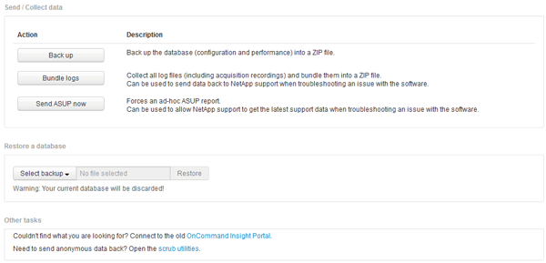

= Senden von Informationen an den NetApp Support
:allow-uri-read: 
:icons: font
:imagesdir: ../media/

[role="lead"]
Über die automatische Support-Einrichtung (ASUP) von NetApp werden Fehlerbehebungsinformationen direkt an das NetApp Kundensupportteam gesendet. Sie können das Senden eines speziellen Berichts erzwingen.

== Schritte

. Klicken Sie in der Insight-Symbolleiste auf *Admin*.
. Klicken Sie Auf *Setup*.
. Klicken Sie auf die Registerkarte *Backup/ASUP*.
. Klicken Sie im Bereich Daten senden/erfassen auf *ASUP jetzt senden*, um Ihre Protokolle, Aufzeichnungen und Backups an den NetApp Support zu senden.
+

