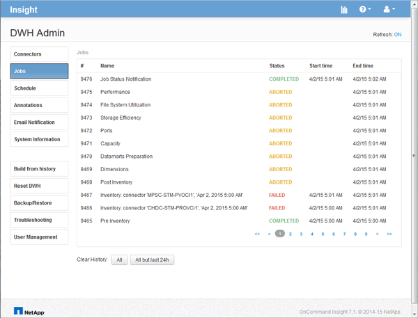

= Zugriff auf das Data Warehouse-Portal
:allow-uri-read: 
:icons: font
:imagesdir: ../media/

[role="lead"]
Das OnCommand Insight-Data-Warehouse-Portal ist eine webbasierte Benutzeroberfläche, mit der Sie Connector-Informationen aktualisieren, Jobwarteschlangen anzeigen, tägliche Builds planen, Anmerkungen auswählen, E-Mail-Benachrichtigungen einrichten, Systeminformationen anzeigen, die Datenbank erstellen, Data Warehouse zurücksetzen, die Datenbank sichern und wiederherstellen, Probleme beheben, Verwalten von Benutzerkonten im Data Warehouse- und Reporting-Portal sowie Zugriff auf Dokumentation und Schemadokumentationen.

== Schritte

. Melden Sie sich beim Data Warehouse-Portal unter an `+https://hostname/dwh+`, Wo `hostname` Ist der Name des Systems, auf dem OnCommand Insight Data Warehouse installiert ist.
. Geben Sie Ihren Benutzernamen und Ihr Kennwort ein.
. Klicken Sie Auf *Login*.
+
Das Data Warehouse-Portal wird geöffnet:

+

