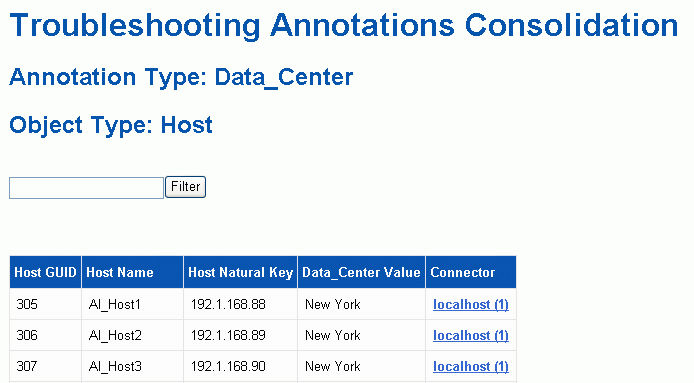

= Lösung mehrerer Probleme bei der Konsolidierung von Serveranmerkungen
:allow-uri-read: 
:icons: font
:imagesdir: ../media/

[role="lead"]
In der Ansicht Anmerkungskonsolidierung in der Ansicht Fehlerbehebung in Data Warehouse wird eine Tabelle angezeigt, die alle verfügbaren Anmerkungstypen und die Objekttypen enthält, auf die sie angewendet werden können.

== Über diese Aufgabe

Die Konsolidierung der Anmerkungswerte basiert auf dem Wert des Anmerkungstyps. Ein Speicher-Array kann zwei verschiedene Tier-Werte haben, die jeweils von einem anderen Konnektor stammen. Wenn also in einem Konnektor ein Tier mit dem Namen Gold definiert ist und in einem zweiten Konnektor ein Tier mit dem Namen Goldy definiert ist, erscheint diese Information im Data Warehouse als zwei separate Tiers.

Da einige Anmerkungstypen die Zuordnung mehrerer Anmerkungswerte zu demselben Objekt ermöglichen, erlaubt Data Warehouse den Objekten (z. B. „`Host`“), ihnen mehrere Anmerkungswerte zuzuweisen (z. B. können „`data Center 1`“ und „`data Center 2“ demselben Host zugewiesen werden).

Die Funktion der Ebenenanmerkung auf Volumes unterscheidet sich etwas von den allgemeinen Anmerkungstabellen. Möglicherweise könnte es eine sehr große Anzahl von Volumes in der Umgebung geben, und die Anzeige aller Volumes im Data Warehouse würde sich auf die Nutzbarkeit der Informationen auswirken. Daher werden in der Ansicht Konsolidierung von Anmerkungen nur die Volumes angezeigt, denen mehrere Tier-Werte zugewiesen sind, und der Speicher, der jedes Volume enthält.

== Schritte

. Melden Sie sich beim Data Warehouse Portal unter an `+https://hostname/dwh+`, Wo `hostname` Ist der Name des Systems, auf dem OnCommand Insight Data Warehouse installiert ist.
. Klicken Sie im Navigationsfenster auf der linken Seite auf *Fehlerbehebung*.
. Klicken Sie im Abschnitt *Konsolidierung von Anmerkungen* in der Zeile für das Objekt auf *Anzeigen*.
+
Im Folgenden sehen Sie ein Beispiel für die Anmerkungen zu Data_Center:

+

