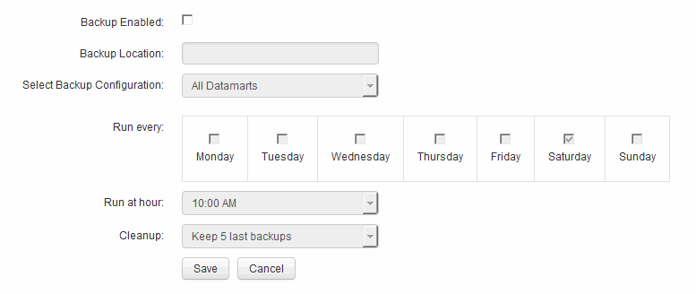

= Planen täglicher Backups
:allow-uri-read: 
:icons: font
:imagesdir: ../media/

[role="lead"]
Obwohl Sie das Data Warehouse manuell mithilfe der Steuerung Backup/Wiederherstellung jederzeit sichern können, empfiehlt es sich, automatische Backups zu planen und zu definieren, wann und wie oft das Backup der Data Warehouse-Datenbank und des Cognos-Content-Speichers durchgeführt werden soll. Backups schützen vor Datenverlust, sodass Sie bei Bedarf die Data Warehouse-Datenbank wiederherstellen können. Sie verwenden auch ein Backup, wenn Sie zu einem neuen Data Warehouse-Server migrieren oder auf eine neue Data Warehouse-Version aktualisieren.

== Über diese Aufgabe

Die Planung von Backups in Zeiten, in denen der Data Warehouse-Server nicht ausgelastet ist, verbessert die Backup-Performance und verringert die Auswirkungen auf Benutzer.

== Schritte

. Melden Sie sich beim Data Warehouse Portal unter an `+https://hostname/dwh+`, Wo `hostname` Ist der Name des Systems, auf dem OnCommand Insight Data Warehouse installiert ist.
. Klicken Sie im Navigationsfenster auf der linken Seite auf *Zeitplan*.
. Klicken Sie im Dialogfeld *Sicherungsplan* auf *Bearbeiten*, um einen neuen Zeitplan hinzuzufügen.
+

. Um die geplanten Backups zu aktivieren, wählen Sie *Backup aktiviert*.
. Geben Sie den Speicherort an, an dem die Sicherungsdateien gespeichert werden sollen.
. Geben Sie die zu sichernden Daten an.
. Geben Sie den Tag oder die Tage an, an denen die Sicherung durchgeführt werden soll.
. Geben Sie an, zu welcher Tageszeit das Backup gestartet werden soll.
. Geben Sie an, wie viele frühere Backup-Kopien Sie behalten möchten.
. Klicken Sie Auf *Speichern*.

