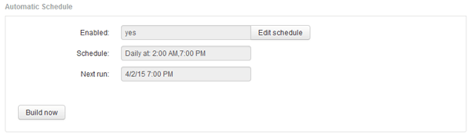

= Planung täglicher Builds
:allow-uri-read: 
:icons: font
:imagesdir: ../media/

[role="lead"]
Obwohl Sie das Data Warehouse manuell erstellen können, indem Sie das Steuerelement Build NOW jederzeit verwenden, empfiehlt es sich, automatische Builds zu planen und zu definieren, wann und wie oft die Data Warehouse-Datenbank erstellt werden soll. Data Warehouse führt einen Build-Job für jeden Konnektor und für jeden Data Mart durch. Data Warehouse führt einen Build-Job für jeden Konnektor für Lizenzen und Inventar aus, und alle anderen Build-Jobs (z. B. Kapazität) werden auf der konsolidierten Datenbank ausgeführt.

== Über diese Aufgabe

Jedes Mal, wenn das Data Warehouse erstellt wird, führt es einen Bestandsauftrag für jeden Konnektor aus. Nachdem die Bestandsaufnahmeaufträge abgeschlossen sind, führt Data Warehouse Jobs für Abmessungen, Kapazität und die übrigen Datentabellen durch.

== Schritte

. Melden Sie sich beim Data Warehouse Portal unter an `+https://hostname/dwh+`, Wo `hostname` Ist der Name des Systems, auf dem OnCommand Insight Data Warehouse installiert ist.
. Klicken Sie im Navigationsfenster auf der linken Seite auf *Zeitplan bearbeiten*.
+

. Klicken Sie im Dialogfeld *Build Schedule* auf *Edit*, um einen neuen Zeitplan hinzuzufügen.
+
image::../media/oci-dwh-admin-schedule-edit-gif.gif[DWH-Zeitplan bearbeiten]

. Wählen Sie die Frequenz - wöchentlich.
. Wählen Sie die Uhrzeit für jeden Tag aus, an dem der Job ausgeführt werden soll.
. Wählen Sie N/A für Tage aus, die Sie nicht ausführen möchten.
. Um den Zeitplan zu aktivieren, wählen Sie *aktiviert*.
+
[NOTE]
====
Wenn Sie diese Option nicht aktivieren, wird der Zeitplan nicht erstellt.

====
. Klicken Sie Auf *Speichern*.
. Um Data Warehouse außerhalb des automatischen geplanten Builds zu erstellen, klicken Sie auf *Build now*.

