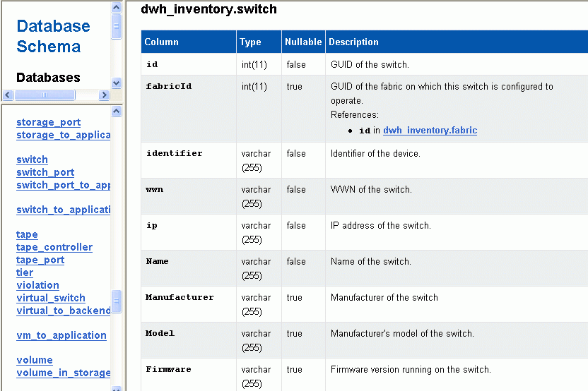

= Anzeigen von Anmerkungsänderungen im Datenbankschema
:allow-uri-read: 
:icons: font
:imagesdir: ../media/

[role="lead"]
Das Datenbankschema spiegelt die Änderungen in der spezifischen Tabelle wider.

== Über diese Aufgabe

Wenn Sie beispielsweise Anmerkungen zu einem Speicher-Array hinzufügen, werden diese in der Speicher- oder Schaltertabelle im Inventar oder anderen Data Marts angezeigt.

Wenn Sie die Anmerkungen zu Ressourcen über die OnCommand Insight-Benutzeroberfläche aktualisieren und den nächsten Data Warehouse-Build starten oder warten, wird eine neue Spalte im entsprechenden Objekt in Inventory (dwh_Inventory) und in der entsprechenden Dimensionstabelle hinzugefügt oder entfernt (In der entsprechenden Datentabelle). Die Ergebnisse werden in den folgenden Tabellen angezeigt:

* dwh_Inventory.annotation_value
* dwh_Inventory.Object_to_annotation

== Schritte

. Klicken Sie Auf image:../media/oci-7-help-icon-gif.gif[""] Klicken Sie in der Data Warehouse-Symbolleiste auf *Dokumentation*.
. Wählen Sie *Datenbankschema*.
. Blättern Sie im Bereich *Datenbankschema* links zum Abschnitt *DWH_INVENTORY* und klicken Sie auf *Switch*.
+

. Die Tabelle *dwh_Inventory.Switch* spiegelt die Änderungen wider:
+
image::../media/oci-dwh-databaseschema-capacity-sd-gif.gif[DWH-Kapazität Datenbank Schema Storage Dimension Tabelle]

+
Die Spalte mit den Anmerkungen zum Rechenzentrum wird in der Tabelle Storage_Dimensions angezeigt.

