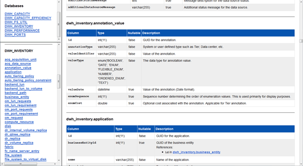

= Anzeigen des Data Warehouse-Datenbankschemas
:allow-uri-read: 
:icons: font
:imagesdir: ../media/

[role="lead"]
Sie können das Datenbankschema anzeigen, um zu verstehen, wie die Daten in einer anderen API verwendet werden oder um SQL-Abfragen zu entwickeln. Die Schemaoption listet alle Datenbanken, Tabellen und Spalten im Schema auf. Sie können auch die Datenbankschemamdiagramme mit den Tabellenbeziehungen überprüfen.

== Schritte

. Melden Sie sich beim Data Warehouse Portal unter an `+https://hostname/dwh+`, Wo `hostname` Ist der Name des Systems, auf dem OnCommand Insight Data Warehouse installiert ist.
. Klicken Sie Auf image:../media/oci-7-help-icon-gif.gif[""] Wählen Sie in der Data Warehouse-Symbolleiste *Dokumentation*.
. Wählen Sie *Datenbankschema*.
. Klicken Sie beispielsweise im Bereich *Databases* auf *DWH_INVENTORY*.
. Blättern Sie im Bereich *Alle Tabellen* nach unten zum Abschnitt *DWH_INVENTORY*, und klicken Sie auf die Tabelle *annotation_value*.
+

+
Die Tabelle dwh_Inventory.Annotation wird angezeigt.

