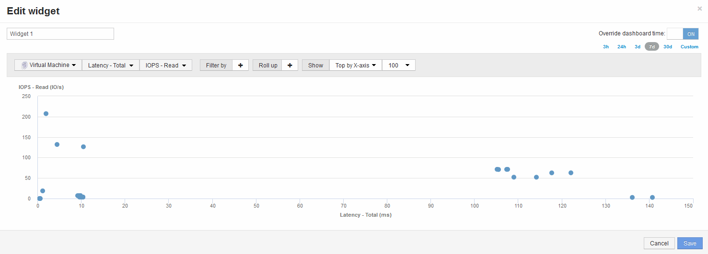

= Vergleichen Sie Metriken-A mit Metriken-B, um Kategorien und Anomalien anzuzeigen
:allow-uri-read: 
:icons: font
:imagesdir: ../media/

[role="lead"]
Sie können ein Streudiagramm verwenden, um zwei Datensätze für jedes Objekt anzuzeigen. Beispielsweise können Sie festlegen, dass für jedes Objekt die Summe aus IOPS-Lese- und -Latenz angezeigt wird. Mithilfe dieses Diagramms können Sie anhand der IOPS und der Latenz zusammen das Objekt identifizieren, das Sie als lästig erachten.

== Schritte

. Fügen Sie dem neuen Dashboard ein Widget mit einem Streudiagramm hinzu: *Widget* > *Streudiagramm*
. Ändern Sie das Standardgerät in Virtual Machine: Klicken Sie auf *Storage* > *Virtual Machine* > *Latency total* > *IOPS Read*
+
Das System zeigt einen Streudiagramm ähnlich der folgenden an: 

