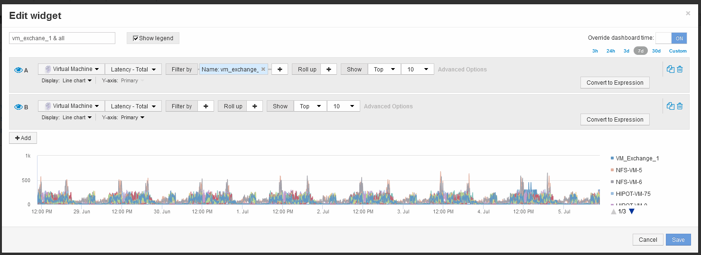

= Vergleichen Sie die Latenzgesamtmenge eines Objekts mit der Latenzgesamtmenge der Top-10-Objekte
:allow-uri-read: 
:icons: font
:imagesdir: ../media/

[role="lead"]
Mit den folgenden Schritten vergleichen Sie die Latenzgesamtmenge einer einzelnen VM mit den VMs, die den Gesamtbetrag der 10 höchsten Latenz der gesamten virtuellen Infrastruktur melden.

== Schritte

. Fügen Sie dem neuen Dashboard ein Widget mit einem Liniendiagramm hinzu: *Widget* > *Liniendiagramm*
+
.. Ändern Sie das Standardgerät in Virtual Machine: Klicken Sie auf *Storage* > *Virtual Machine* > *Latency-total*
+
Das Widget zeigt die Gesamtlatenz für alle VMs für die standardmäßigen 24 Stunden in einem Flächendiagramm an.

.. Erstellen Sie eine zweite Anzeige in diesem Widget, die Latenz insgesamt gemittelt für alle VMs zeigt: *Widget* > *Liniendiagramm*
.. Ändern Sie das Standardgerät in Virtual Machine: Klicken Sie auf *Storage* > *Virtual Machine* > *Latency-Total*
+
Das Widget zeigt die Latenzsumme für den standardmäßigen 24-Stunden-Zeitraum unter Verwendung eines Liniendiagramms an.

.. Klicken Sie auf *X* in der *Roll Up*-Leiste und wählen Sie *Show* > *Top* > *10*

+
Das System zeigt die 10 wichtigsten VMs auf Basis der Latenz – gesamt an. 

. Fügen Sie die VM hinzu, die Sie mit den Top 10 vergleichen möchten:
+
.. Klicken Sie Auf *+Hinzufügen*
.. Ändern Sie das Standardgerät in Virtual Machine: Klicken Sie auf *Storage* > *Virtual Machine* > *Latency total*
.. Klicken Sie auf *Filtern nach* > *Name* > *€21.1*

. Klicken Sie auf *Legende anzeigen*

== Ergebnisse

Eine Legende gibt die einzelnen VMs an, die analysiert werden. Sie können VM_Exchange_1 leicht identifizieren und feststellen, ob eine Latenz ähnlich den zehn wichtigsten VMs der Umgebung auftritt.
