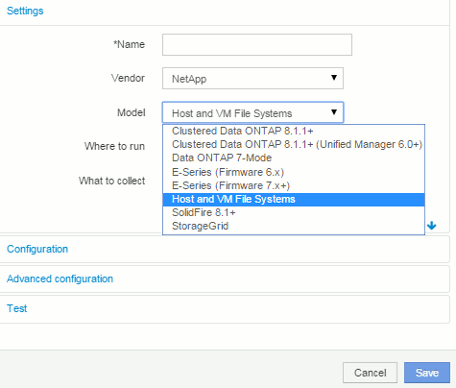

= Konfigurieren Sie Insight für die Dateisystemsammlung
:allow-uri-read: 
:icons: font
:imagesdir: ../media/

[role="lead"]
Um Insight für die Erfassung von Dateisystemauslastungsdaten zu konfigurieren, müssen Sie die Host Utilization Pack Lizenz installieren und die Datenquelle von NetApp Host und VM File Systems konfigurieren.

== Bevor Sie beginnen

Installieren Sie die Host Utilization Pack-Lizenz, wenn Sie dies noch nicht getan haben. Sie können die Lizenz auf der Seite *Admin* > *Setup* auf der Registerkarte *Lizenzen* überprüfen.

Die Datenquelle „Host and VM File Systems“ meldet nur die Auslastung des Dateisystems und die Metadaten des Dateisystems für bekannte * Compute Resources* (Hosts und VMs), die derzeit in Insight erfasst oder erkannt werden:

* Virtual Machines werden von Hypervisor-Datenquellen wie Hyper-V und VMware erfasst.
* Hosts werden über Geräteauflösung erkannt.

Die richtigen Tier-Annotationen müssen über die entsprechenden Storage-Ressourcen vorhanden sein.

Die folgenden verbundenen Blockspeichergeräte werden unterstützt:

* NetApp Clustered Data ONTAP (cDOT)
* NetApp 7-Mode
* Clariion
* Windows: VMware Virtual Disks (VMDKs) für FC, iSCSI
* Linux: VMware VMDKs (iSCSI und FC nicht unterstützt)

Eine *Compute Resource Group* ist eine Annotation, die das Gruppieren von Hosts und/oder virtuellen Maschinen ermöglicht, die gemeinsame administrative Anmeldedaten verwenden.

== Schritte

. Notieren Sie zunächst die Hosts und/oder virtuellen Maschinen, die in Ihre *Compute Resource Group* aufgenommen werden sollen. Gehen Sie zu *Abfragen* > *+Neue Abfrage* und suchen Sie nach _Virtual Machine_ Assets.
+
Sie müssen diese Schritte für _Host_-Assets wiederholen.

. Klicken Sie auf die Spaltenauswahl rechts neben der Tabelle und wählen Sie die Spalte *Compute Resource Group* aus, um sie in der Abfrageergebnistabelle anzuzeigen.
. Wählen Sie die virtuellen Maschinen aus, die Sie der gewünschten Compute-Ressourcengruppe hinzufügen möchten. Sie können einen Filter verwenden, um nach bestimmten Assets zu suchen.
. Klicken Sie auf die Schaltfläche *actions* und wählen Sie *Anmerkung bearbeiten*.
. Wählen Sie die Anmerkung _Compute Resource Group_ aus, und wählen Sie dann den gewünschten Namen der Ressourcengruppe im Feld _Value_ aus.
+
Die Annotation der Ressourcengruppe wird den ausgewählten VMs hinzugefügt. Der Name der Ressourcengruppe muss mit dem Namen übereinstimmen, den Sie später in der Datenquelle „Host“ und „VM File Systems“ konfigurieren werden.

. Um die Datenquelle von Host und VM File Systems für eine Compute Resource Group zu konfigurieren, klicken Sie auf *Admin* > *Data Sources* und *Add* die _NetApp Host und VM File Systems_ Datenquelle.
+

. Geben Sie im Abschnitt *Konfiguration* einen *Benutzernamen* und ein *Passwort* für einen Betriebssystembenutzer mit entsprechenden Rechten zum Abrufen von Dateisystemdaten ein. Für Windows-Betriebssystembenutzer muss dies das Domänenpräfix enthalten, wenn es in Ihrer Windows-Umgebung verwendet wird.
+
Beachten Sie, dass eine Insight Acquisition Unit (AU), die unter Linux installiert ist, Berichte über Linux-Rechenressourcen erstellen kann, während eine AU unter Windows mit Linux- oder Windows-Rechenressourcen kommunizieren kann.

. Geben Sie den Namen der *Compute Resource Group* für die Assets ein, aus denen Sie die Dateisystemnutzungsdaten erfassen möchten. Dieser Name muss mit dem Namen der Ressourcengruppe übereinstimmen, mit der Sie die oben genannten Assets mit Anmerkungen versehen haben.
+
Wenn Sie das Feld Compute Resource Group leer lassen, sammelt die Datenquelle Daten für Hosts oder VMs, die keine Anmerkungen zu Compute Resource Group haben.

. Geben Sie im Abschnitt **Advanced Configuration**das gewünschte Abfrageintervall für diese Datenquelle ein. Der Standardwert von 6 Stunden ist in der Regel ausreichend.
. Es wird empfohlen, die Datenquellenverbindung vor dem Speichern *zu testen*. Ein erfolgreiches Verbindungsergebnis zeigt Ihnen auch an, wie viele Compute-Ressourcenziele in der Gruppe enthalten sind.
. Klicken Sie Auf *Speichern*. Die Datenquelle „Host and VM File Systems“ beginnt bei der nächsten Abfrage mit dem Sammeln von Daten.
. Sobald Dateisystemdaten erfasst wurden, können Sie sie auf der Asset-Seite des Hosts oder der VM im Widget „Dateisystem“ anzeigen:
+
image::../media/hostutil-vmlpfstable.gif[Hostutil vmlpfstable]

. Wiederholen Sie diese Schritte für jede Compute Resource Group, die Sie haben werden. Jede Compute-Ressourcengruppe muss einer eigenen Host- und VM-Dateisystemquelle zugeordnet sein.
+
Beachten Sie, dass Dateisysteminformationen für Hosts und VMs erfasst werden, die bereits von herkömmlichen VMware oder Hyper-V Datenquellen in Ihrer Umgebung erfasst werden.

