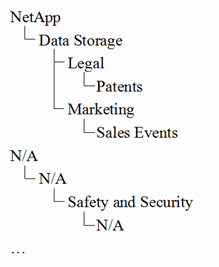

= Konfigurieren von Geschäftseinheiten für Ihr Unternehmen
:allow-uri-read: 
:icons: font
:imagesdir: ../media/

[role="lead"]
Wenn Sie die Geschäftselemente Ihrer Unternehmensstruktur verstehen, können Sie die Ressourcennutzung verfolgen und Kostenberichte erstellen. Hier konfigurieren wir Ihre Unternehmenseinheiten.

== Über diese Aufgabe

Mit OnCommand Insight können Sie Geschäftseinheiten in einer Hierarchie definieren, die bis zu vier Granularitätsstufen umfasst.

* *Mieter*
+
Wird in erster Linie von Dienstleistern zur Zuordnung von Ressourcen zu einem Kunden verwendet. Die Mandantenebene ist erforderlich, wenn Ihr Unternehmen ein ISP ist und Sie die Ressourcennutzung von Kunden verfolgen möchten.

* *Geschäftsbereich*
+
Ein Geschäftsbereich oder eine Produktlinie innerhalb eines Unternehmens, z. B. Storage. Geschäftsbereich ist in der Hierarchie erforderlich, wenn die Daten für verschiedene Produktlinien nachverfolgt werden müssen.

* *Geschäftsbereich*
+
Repräsentiert eine traditionelle Geschäftseinheit wie Legal oder Marketing. Die Geschäftseinheit ist erforderlich, wenn Sie die Daten verschiedener Abteilungen nachverfolgen müssen. Diese Hierarchieebene ist oft wertvoll, wenn es darum geht, eine Ressource zu trennen, die von einer Abteilung genutzt wird, die von anderen Abteilungen nicht genutzt wird.

* * Projekt*
+
Wird häufig zur Identifizierung eines bestimmten Projekts in einer Geschäftseinheit verwendet, für das Kapazitätszuordnung gewünscht wird. Beispielsweise kann „`Patente`“ ein Projektname für die Rechtsabteilung und „`Verkaufsveranstaltungen`“ ein Projektname für die Geschäftseinheit Marketing sein. Beachten Sie, dass die Namen der Ebenen Leerzeichen enthalten können.

Ein Beispiel für eine Unternehmenshierarchie wäre:

Best Practice: Erstellen Sie eine Tabelle mit jeder Zeile, die eine vollständige Geschäftseinheit in Ihrer Hierarchie zeigt:

|===

| Mandant | Geschäftsbereich | Geschäftsbereich | Projekt 

 a| 
NetApp
 a| 
Datenspeicher
 a| 
Legal
 a| 
Patente

 a| 
NetApp
 a| 
Datenspeicher
 a| 
Marketing
 a| 
Verkaufsveranstaltungen

 a| 
K. A.
 a| 
K. A.
 a| 
Sicherheit
 a| 
K. A.

 a| 
...
 a| 
 a| 
 a| 

|===
[NOTE]
====
Sie müssen nicht alle Ebenen für das Design Ihrer Unternehmenshierarchie verwenden. Sie können „`N/A`“ für nicht verwendete Stufen auswählen.

====
So erstellen Sie eine Unternehmenshierarchie in Insight:

== Schritte

. Melden Sie sich bei Insight als Benutzer mit Administratorrechten an.
. Wählen Sie *Verwalten* > *Business Entities*.
. Klicken Sie auf die Schaltfläche *+Add*
. Klicken Sie in das Feld *Tenant* und geben Sie Ihren Mieternamen ein.
+
Wenn Sie bereits Mandanten für Ihre Umgebung eingegeben haben, wird eine Liste der vorhandenen Mandanten angezeigt, aus der Sie auswählen können. Sie können auch „N/A“ wählen, wenn der Mandant für diese Geschäftseinheit nicht zutrifft.

. Wiederholen Sie dies für *Geschäftsbereich*, *Geschäftsbereich* und *Projekt*.
. Klicken Sie Auf *Speichern*

== Nachdem Sie fertig sind

Best Practices:

* Ordnen Sie Ihre Unternehmenshierarchie in einer Tabelle zu, und überprüfen Sie, ob die Namen in der Hierarchie in den Ansichten und Berichten von Insight selbsterklärend sind.
* Erstellen Sie Ihre Geschäftseinheiten in Insight, bevor Sie Anwendungen erstellen.
* Identifizieren und Auflisten aller Applikationen, die den einzelnen Geschäftsbereichen zugeordnet werden

