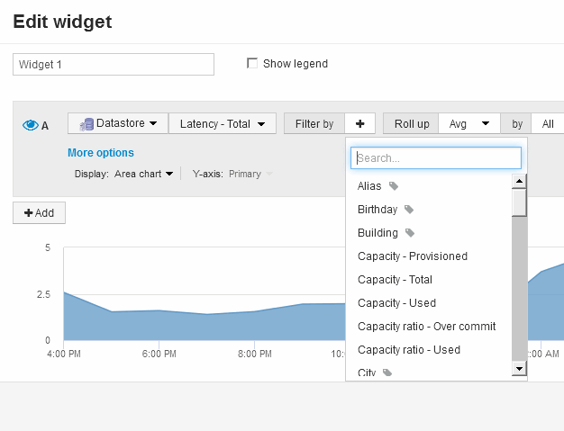

= Anfragen und Filter für das Dashboard-Widget
:allow-uri-read: 
:icons: font
:imagesdir: ../media/

[role="lead"]
Die Abfrage in einem Dashboard-Widget ist ein leistungsstarkes Tool zur Verwaltung der Anzeige Ihrer Daten. Hier sind einige Dinge zu beachten über Widget-Abfragen.

Einige Widgets können bis zu fünf Abfragen haben. Jede Abfrage erstellt im Widget einen eigenen Satz von Linien oder Diagrammen. Das Einrichten von Rollup, Gruppierung, Ergebnissen von oben/unten usw. auf einer Abfrage hat keine Auswirkungen auf andere Abfragen für das Widget.

Sie können auf das Augensymbol klicken, um eine Abfrage vorübergehend auszublenden. Das Widget wird automatisch aktualisiert, wenn Sie eine Abfrage ausblenden oder anzeigen. Auf diese Weise können Sie die angezeigten Daten auf einzelne Abfragen überprüfen, während Sie Ihr Widget erstellen.

Die folgenden Widget-Typen können mehrere Abfragen haben:

* Diagramm Bereich
* Stapelgebietskarte
* Liniendiagramm
* Spline-Diagramm
* Widget mit einem einzelnen Wert

Die übrigen Widget-Typen können nur eine einzige Abfrage haben:

* Tabelle
* Balkendiagramm
* Box-Darstellung
* Streudiagramm

== Filtern in Dashboard-Abfragen

Sie können mit einer der folgenden Filter Ihre Suche in einem beliebigen *Textfeld* in der Abfrage verfeinern:

* Mit einem Sternchen können Sie nach allem suchen. Beispiel: `vol*rhel` Zeigt alle Ressourcen an, die mit „`vol`“ beginnen und mit „`RHEL`“ enden.
* Mit dem Fragezeichen können Sie nach einer bestimmten Anzahl von Zeichen suchen. Beispiel: `BOS-PRD??-S12` Zeigt BOS-PRD12-S12, BOS-PRD13-S12 usw. an.
* Mit dem Operator ODER können Sie mehrere Einheiten angeben. Beispiel: `FAS2240 OR CX600 OR FAS3270` Findet mehrere Storage-Modelle
* Der NICHT-Operator ermöglicht es Ihnen, Text aus den Suchergebnissen auszuschließen. Beispiel: `NOT EMC*` Findet alles, was nicht mit „`EMC`“ beginnt. Verwenden Sie können `NOT *` Um Felder anzuzeigen, die Null-Werte enthalten.

Wenn Sie einen Filter in doppelte Anführungszeichen einschließen, behandelt Insight alles zwischen dem ersten und dem letzten Zitat als exakte Übereinstimmung. Alle Sonderzeichen oder Operatoren in den Angeboten werden als Literale behandelt. Wenn Sie beispielsweise nach „`*`“ filtern, werden Ergebnisse zurückgegeben, die ein wörtliches Sternchen sind. Das Sternchen wird in diesem Fall nicht als Platzhalter behandelt. Die Operatoren UND, OR und NOT werden auch als Literalzeichenfolgen behandelt, wenn sie in Doppelzitate eingeschlossen sind.

== Identifizieren von Objekten, die von Abfragen und Filtern zurückgegeben werden

Die von Abfragen und Filtern zurückgegebenen Objekte sehen ähnlich aus wie in der folgenden Abbildung. Objekte, denen Tags zugewiesen sind, sind Annotationen, während die Objekte ohne Tags Performance-Zähler oder Objektattribute sind.

