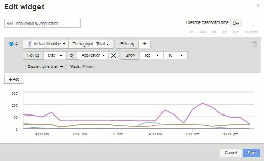

= Benutzerdefiniertes Dashboard: Virtual Machine Performance
:allow-uri-read: 
:icons: font
:imagesdir: ../media/

[role="lead"]
Benutzerdefinierte Dashboards und Widgets von OnCommand Insight ermöglichen eine Betriebsansicht von Bestands- und Performance-Trends.

== Über diese Aufgabe

IT-Abteilungen stehen heute vor zahlreichen Herausforderungen. Von Administratoren muss mit weniger Aufwand mehr erreicht werden, und eine vollständige Übersicht über dynamische Datacenter ist daher ein muss. In diesem Beispiel zeigen wir Ihnen, wie Sie ein benutzerdefiniertes Dashboard mit Widgets erstellen, die Ihnen betriebliche Einblicke in die Leistung der virtuellen Maschine in Ihrer Umgebung geben. Wenn Sie diesem Beispiel folgen und Widgets erstellen, die auf Ihre spezifischen Anforderungen zugeschnitten sind, können Sie die Back-End-Storage-Performance im Vergleich zur Front-End-VM (VM)-Performance visualisieren oder die VM-Latenz im Vergleich zur I/O-Anforderung anzeigen.

Individuelle Dashboards ermöglichen Ihnen, Prioritäten für Ihre Bemühungen zu setzen und die Verfügbarkeit von Ressourcen zu ermitteln. Sie können auf Ebbe und Flut von Workloads reagieren und die Zeit für die Erkennung und Behebung aufkommender Probleme minimieren. Benutzerdefinierte Dashboards bieten Ihnen die Flexibilität, priorisierte Ansichten in geschäftskritische Infrastrukturen zu erstellen. Sie sind nützlich, um die Performance-Verfügbarkeit in heterogenen Technologien zu ermitteln.

Hier werden wir ein Dashboard für die Performance von virtuellen Maschinen erstellen, das Folgendes enthält:

* Eine Tabelle mit VM-Namen und Performance-Daten
* Ein Diagramm, das VM-Latenz mit Storage-Latenz vergleicht
* Ein Diagramm mit den Angaben zu Lese-, Schreib- und IOPS insgesamt für VMs
* Ein Diagramm zeigt den maximalen Durchsatz für Ihre VMs

Dies ist nur ein einfaches Beispiel. Sie können Ihr Dashboard anpassen, um Performance-Daten hervorzuheben und zu vergleichen, die Sie für Ihre eigenen Best Practices im Betrieb auswählen.

== Schritte

. Melden Sie sich bei Insight als Benutzer mit Administratorrechten an.
. Wählen Sie im Menü *Dashboards* die Option *+Neues Dashboard*.
+
Die Seite Neues Dashboard wird geöffnet.

. Geben wir unserem Dashboard einen aussagekräftigen Namen. Klicken Sie Auf *Speichern*. Geben Sie im Feld *Name* einen eindeutigen Namen für das Dashboard ein, z. B. „`VM Performance by Application`“.
. Klicken Sie auf *Speichern*, um das Dashboard mit dem neuen Namen zu speichern.
. Beginnen wir mit dem Hinzufügen unserer Widgets. Schieben Sie bei Bedarf den Schalter *Bearbeiten* auf „`on`“, um den Bearbeitungsmodus zu aktivieren.
. Klicken Sie auf die Schaltfläche *Widget* und wählen Sie *Tabelle Widget*, um ein neues Tabelle Widget zum Dashboard hinzuzufügen.
+
Das Dialogfeld Widget bearbeiten wird geöffnet. Der Standardname ist „`Widget 1`“, und die Standarddaten werden für alle Speicher in Ihrer Umgebung angezeigt.

+
image::../media/customdash-vm-table-1.gif[Customdash vm-Tabelle 1]

. Wir können dieses Widget anpassen. Löschen Sie im Feld Name „`Widget 1`“, und geben Sie „`Virtual Machine Performance table`“ ein.
. Klicken Sie auf das Dropdown-Menü Asset-Typ und ändern Sie *Storage* in *Virtual Machine*.
+
Die Änderungen an den Tabellendaten werden angezeigt, wenn alle Virtual Machines in Ihrer Umgebung angezeigt werden. Vorerst werden in der Tabelle nur die VM-Namen angezeigt. Fügen wir der Tabelle einige Spalten hinzu.

. Klicken Sie auf *Spalten*image:../media/column-picker-button.gif[""] Und wählen Sie _Data Center_, _Storage Name_ und _IOPS - Total_ aus. Sie können auch versuchen, den Namen in die Suche einzugeben, um schnell die gewünschten Felder anzuzeigen.
+
Diese Spalten werden nun in der Tabelle angezeigt. Sie können die Tabelle nach einer dieser Spalten sortieren. Beachten Sie, dass die Spalten in der Reihenfolge angezeigt werden, in der sie dem Widget hinzugefügt wurden.

. Bei dieser Übung werden wir VMs ausschließen, die nicht aktiv genutzt werden. Wir sollten also etwas mit weniger als 10 IOPS insgesamt herausfiltern. Klicken Sie neben *Filter by* auf die Schaltfläche` + ` und wählen Sie__IOPS - Total (IO/s)__. Klicken Sie auf *any* und geben Sie "`10`" in das Feld *von* ein. Lassen Sie das Feld * to* leer. Klicken Sie auf das image:../media/check-box-ok.gif[""] Um den Filter zu speichern.
+
Die Tabelle zeigt jetzt nur VMs mit insgesamt 10 IOPS oder mehr.

. Wir können die Tabelle weiter reduzieren, indem wir Ergebnisse gruppieren. Klicken Sie neben *Gruppieren nach* auf die Schaltfläche „` + `“ und wählen Sie ein Feld aus, nach dem Sie gruppieren möchten, z. B. Applikation oder Cluster. Gruppierung wird automatisch angewendet.
+
Die Tabellenzeilen werden nun entsprechend Ihrer Einstellung gruppiert. Sie können die Gruppen nach Bedarf erweitern und reduzieren. Gruppierte Zeilen zeigen gerollte Daten für jede der Spalten an. In einigen Spalten können Sie die Aufrollmethode für diese Spalte auswählen.

+
image::../media/custom-dashboard-editwidget-table-populated-5-5.png[Benutzerdefinierte Dashboard-editWidget-Tabelle ausgefüllt 5 5]

. Wenn Sie das Tabellen-Widget an Ihre Zufriedenheit angepasst haben, klicken Sie auf die Schaltfläche *Speichern*.
+
Das TabellenWidget wird im Dashboard gespeichert.

. Sie können die Größe des Widgets auf dem Dashboard ändern, indem Sie die untere rechte Ecke ziehen. Machen Sie das Widget breiter, um alle Spalten deutlich anzuzeigen. Klicken Sie auf *Speichern*, um das aktuelle Dashboard zu speichern.
. Als nächstes fügen wir einige Diagramme hinzu, um unsere VM-Performance anzuzeigen. Erstellen wir nun ein Liniendiagramm, in dem die VM-Latenz mit der Storage-Latenz verglichen wird.
. Schieben Sie bei Bedarf den Schalter *Bearbeiten* auf „`on`“, um den Bearbeitungsmodus zu aktivieren.
. Klicken Sie auf die Schaltfläche *Widget* und wählen Sie *Liniendiagramm*, um ein neues Liniendiagramm-Widget zum Dashboard hinzuzufügen.
+
Das Dialogfeld Widget bearbeiten wird geöffnet. Klicken Sie auf das Feld *Name* und benennen Sie dieses Widget „`VM vs. Storage Max Latency`“.

. Wählen Sie *Virtual Machine* und wählen Sie *Latency - Max*. Stellen Sie alle gewünschten Filter ein, oder lassen Sie *Filter durch* leer. Wählen Sie für *Roll-up* „`sum`“ von „`All`“. Diese Daten als**Liniendiagramm** anzeigen und die Y-Achse als *primär* belassen.
. Klicken Sie auf die Schaltfläche *+Add*, um eine zweite Datenzeile hinzuzufügen. Wählen Sie für diese Zeile *Storage* und *Latency - Max* aus. Stellen Sie alle gewünschten Filter ein, oder lassen Sie *Filter durch* leer. Wählen Sie für *Roll-up* „`sum`“ von „`All`“. Diese Daten als**Liniendiagramm** anzeigen und die Y-Achse als *primär* belassen.
+
image::../media/customdash-latencywidgetsettings.gif[Custosdash latencywidgetsettings]

. Klicken Sie auf *Speichern*, um dieses Widget zum Dashboard hinzuzufügen.
. Als nächstes fügen wir ein Diagramm mit den IOPS „Lesen“, „Schreiben“ und „Gesamt“ in einem einzelnen Diagramm ein.
. Klicken Sie auf die Schaltfläche *Widget* und wählen Sie *Bereichsdiagramm*, um ein neues Widget für die Flächendiagramme zum Dashboard hinzuzufügen.
+
Das Dialogfeld Widget bearbeiten wird geöffnet. Klicken Sie auf das Feld *Name* und benennen Sie dieses Widget „`VM IOPS`“.

. Wählen Sie *Virtual Machine* und wählen Sie *IOPS - Total*. Stellen Sie alle gewünschten Filter ein, oder lassen Sie *Filter durch* leer. Wählen Sie für *Roll-up* „`sum`“ von „`All`“. Diese Daten als**Flächendiagramm** anzeigen und die Y-Achse als *primär* belassen.
. Klicken Sie auf die Schaltfläche +Hinzufügen, um eine zweite Datenzeile hinzuzufügen. Wählen Sie für diese Zeile *Virtual Machine* und wählen Sie *IOPS - Lesen*. Y-Achse als *primär* belassen.
. Klicken Sie auf die Schaltfläche +Hinzufügen, um eine dritte Datenzeile hinzuzufügen. Wählen Sie für diese Zeile *Virtual Machine* und wählen Sie *IOPS - Write*. Y-Achse als *primär* belassen.
+
image::../media/custom-dashboard-vm-iops-chart.gif[Benutzerdefiniertes Dashboard: vm-iops-Diagramm]

. Klicken Sie auf *Speichern*, um dieses Widget zum Dashboard hinzuzufügen.
. Danach fügen wir ein Diagramm hinzu, das den VM-Durchsatz für jede mit der VM verbundene Applikation anzeigt. Dafür nutzen wir die Roll-Up-Funktion.
. Klicken Sie auf die Schaltfläche *Widget* und wählen Sie *Liniendiagramm*, um ein neues Liniendiagramm-Widget zum Dashboard hinzuzufügen.
+
Das Dialogfeld Widget bearbeiten wird geöffnet. Klicken Sie auf das Feld *Name* und benennen Sie dieses Widget „`VM Throughput by Application`“.

. Wählen Sie *Virtual Machine* und wählen Sie *Throughput - Total*. Stellen Sie alle gewünschten Filter ein, oder lassen Sie *Filter durch* leer. Wählen Sie für *Roll-up* „`Max`“ und dann „`Application`“ oder „`Name`“. Zeigen Sie die *Top 10*-Anwendungen an. Diese Daten als**Liniendiagramm** anzeigen und die Y-Achse als *primär* belassen.
+

. Klicken Sie auf *Speichern*, um dieses Widget zum Dashboard hinzuzufügen.
. Sie können Widgets verschieben, indem Sie die Maustaste an einer beliebigen Stelle im oberen Bereich des Widgets gedrückt halten und an eine neue Position ziehen. Sie können die Größe von Widgets ändern, indem Sie die untere rechte Ecke ziehen. Achten Sie darauf, das Dashboard nach den Änderungen *Speichern* zu speichern.
+
Ihr letztes VM Performance Dashboard sieht folgendermaßen aus:

+
image::../media/customdashboard-vm-performance-dashboard.png[Anpassbar am dashboard für vm-Performance]

