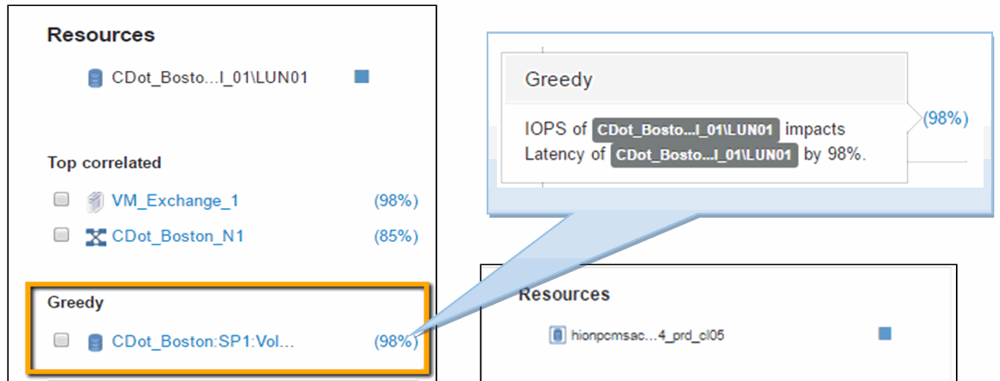

= Untersuchung des internen Volumens
:allow-uri-read: 
:icons: font
:imagesdir: ../media/

image::../media/greedy-vol1.gif[Gieriges Vol1]

Auf der Landing Page Internes Volume wird Folgendes angezeigt:

* Die Performance-Diagramme des internen Volumes entsprechen den zuvor für die Applikations-Performance sowohl für Latenz als auch für IOPS sichtbaren Werten.
* Im Abschnitt „Ressourcen“, in dem die korrelierten Assets angezeigt werden, wird eine „`gierig`“-Ressource identifiziert (CDOT_Boston:SP1:Vol_01).

Eine gierige Ressource wird durch Analysen zur Korrelation von Einblicken identifiziert. Gierige/beeinträchtigte Ressourcen sind „`Peers`“, die dieselbe gemeinsame Ressource nutzen. Die übergriffige Ressource verfügt über IOPS-Werte oder Auslastungsraten, die sich negativ auf die IOPS oder die Latenz der beeinträchtigten Ressource auswirken.

Übergriffige und beeinträchtigte Ressourcen lassen sich auf den Landing Pages der Virtual Machine, des Volumes und des internen Volumes ermitteln. Auf jeder Landing Page werden maximal zwei gierige Ressourcen angezeigt.

Die Auswahl des Korrelationsrankings (%) liefert die gierigen Ergebnisse der Ressourcenanalyse. Wenn Sie beispielsweise auf einen übergriffigen Prozentwert klicken, wird der Vorgang für ein Asset identifiziert, das sich auf das beeinträchtigte Asset auswirkt, ähnlich wie im folgenden Beispiel dargestellt.

Wenn eine herabgesetzte Ressource erkannt wird, können Sie die Bewertung degraded (%) auswählen, um den Vorgang und die Ressource zu identifizieren, die sich auf die beeinträchtigte Ressource auswirkt.

image::../media/guid-13582cf7-aedf-47d1-935e-edc7c5b1b921.gif[guid 13582cf7 aedf 47d1 935e edc7c5b1b921]
