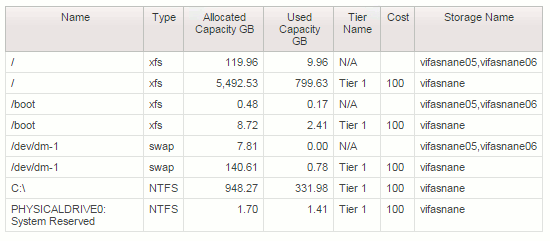

= Chargeback und Berichterstellung für Filesysteme
:allow-uri-read: 
:icons: font
:imagesdir: ../media/

[role="lead"]
Die Kostenverrechnung für File-Systeme erfolgt immer aus der Storage-Perspektive. Speicher-Arrays, die mit virtuellen Maschinen verknüpft sind, die für eine bestimmte Compute-Ressourcengruppe mit Anmerkungen versehen sind, werden in Chargeback-Berichten für diese Ressourcengruppe aufgenommen.

== Bevor Sie beginnen

Alle virtuellen Maschinen, die Sie in die Kostenzuordnung für die Dateisystemauslastung einbeziehen möchten, müssen mit dem entsprechenden Namen der Compute-Ressourcengruppe versehen werden. Storage-Arrays, die diesen Virtual Machines zugeordnet sind, müssen mit den entsprechenden Tier-Annotationen versehen werden. ETL in Data Warehouse muss nach der Erstellung dieser Anmerkungen erfolgt sein.

== Schritte

. Öffnen Sie in der Regel einen Browser für Ihren Reporting-Server `https://<host or IP>:9300/p2pd``http://<host or IP\>:9300/bi (7.3.3 or later)` Und melden Sie sich an.
. Wählen Sie das Paket *File System Utilization* und erstellen Sie einen neuen Bericht.
+
image::../media/fs-util-pkg.gif[fs util pkg]

. Ziehen Sie Elemente aus Ihren Data Mart(s), um Ihren Bericht zu erstellen.
+
Das folgende Beispiel ist ein sehr einfacher Bericht. Sie können komplexe Berichte erstellen, die auf Ihre spezifischen Geschäftsanforderungen abgestimmt sind.

+

