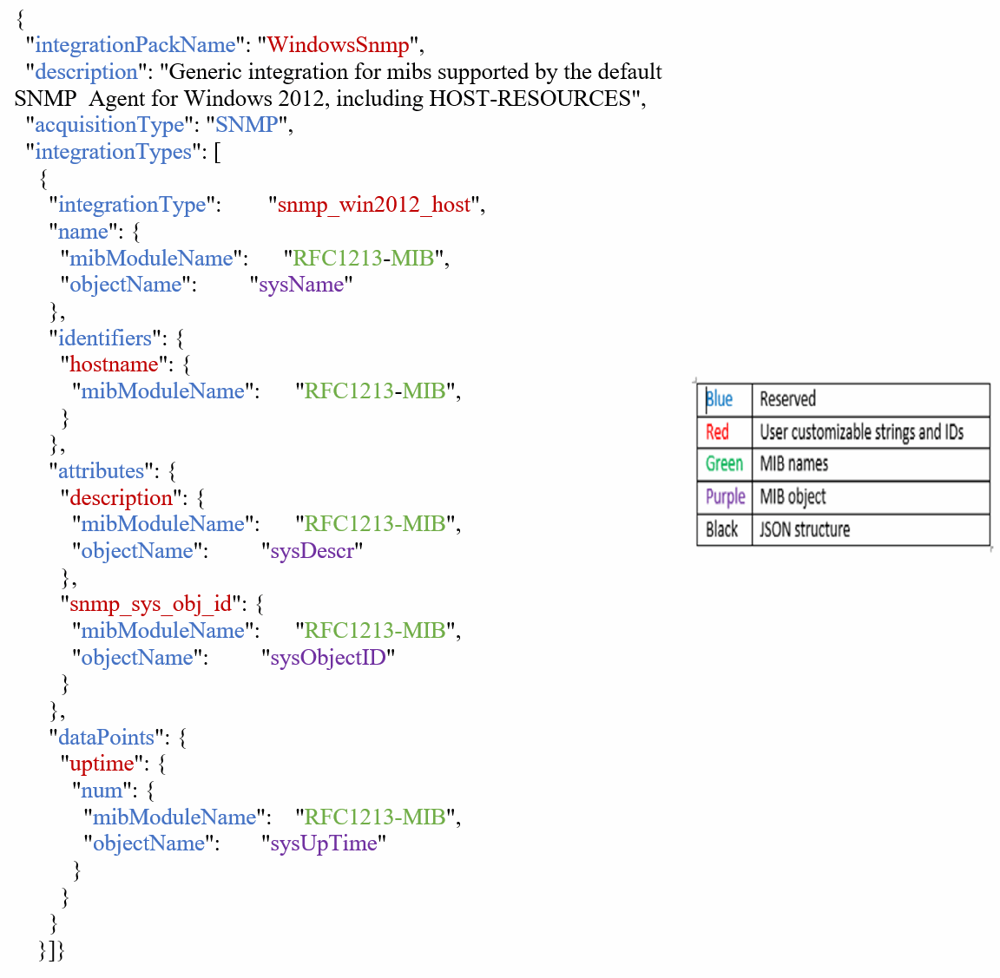

= Integration.json-Dateiinformationen
:allow-uri-read: 
:icons: font
:imagesdir: ../media/

[role="lead"]
Die Datei Integration.json identifiziert die Nutzlast .

Die folgende Abbildung zeigt eine farbcodierte Darstellung einer einfachen Integration.json-Datei. In der beigefügten Tabelle wird die Funktion der Objekte in der Datei angegeben.

== Info zu Integration.json-Dateien

Jedes Feld hat folgende Merkmale:

* Der Abschnitt „Identifiers“ bildet einen eindeutigen zusammengesetzten Schlüssel zur Erstellung eines neuen „Objekts“ in Insight
* Die "Attribute" liefern unterstützende Metadaten zum Objekt.
+
In beiden Fällen wird nur der Wert des neuesten Berichts für dieses Objekt (identifiziert durch die Kennungen) beibehalten.

* Die „Datenpunkte“ sind Zeitreihendaten und müssen numerische Werte sein. Insight speichert jeden hier gemeldeten Wert standardmäßig 90 Tage lang und verknüpft diese Zeitreihen mit dem identifizierten Objekt.

== Numerische Ausdrücke

Standardmäßig werden alle Wertausdrücke als Strings in der Integrations-Payload gemeldet. „Identifiers“ und „Attribute“ können nur Zeichenfolgenwerte definieren. „Datapoint“ kann String- oder numerische Werte definieren. Numerische Werte werden mit einem der folgenden Zusatztasten definiert:

* num - die Gesamtzahl der empfangenen Bytes seit der letzten Initialisierung des Zählers
* delta - die Anzahl der Bytes, die während des Abfrageintervalls empfangen wurden
* Rate: Die durchschnittliche Empfangsrate während des Abfrageintervalls in Byte pro Sekunde
+
Eine durchschnittliche Empfangsrate während des Abfrageintervalls in Megabyte pro Sekunde kann mithilfe einer Kombination aus Rate und mathematischen Operationen durchgeführt werden

== Mathematische Vorgänge

Der `integration.json` File unterstützt die folgenden mathematischen Operationen: Add, subtrahieren, multiplizieren, dividieren. Das folgende Beispiel zeigt Multiplikations-, Division- und Sum-Operationen in einer JSON-Datei.

image::../media/net-util-rhel.gif[NET util RHEL]

== Stichwörter

Ein Integrationspaket-Schlüsselwort, String, wird implementiert, um OKTETT-Strings oder proprietäre Typen, die aus OKTETT-STRINGS abgeleitet werden, zu erzwingen, die normalerweise im hexadezimalen Format gerendert werden, um stattdessen als ASCII-Zeichen dargestellt zu werden.

Häufig ENTHALTEN OKTETT-Strings binäre Daten, z. B. MAC-Adressen und WWNs:

[listing]
----
        "interface_mac": {
                  "mibModuleName":      "IF-MIB",
                  "objectName":         "ifPhysAddress"
                 }
----
IfPhysAddress ist der Typ PhysAddress, der nur EIN OKTETT-STRING ist:

[listing]
----
  PhysAddress ::= TEXTUAL-CONVENTION
                DISPLAY-HINT "1x:"
                STATUS       current
                DESCRIPTION
                                "Represents media- or physical-level addresses."
                SYNTAX       OCTET STRING
----
Wenn ifPhysAddress standardmäßig als Hex gerendert wird, ist das Ergebnis:

[listing]
----
"interface_mac": "00:50:56:A2:07:E7"
----
Wenn Sie jedoch einen OKTETT-STRING oder einen proprietären Typ haben, der von OKTETT-STRING abgeleitet wurde, den Sie als ASCII interpretieren möchten, können Sie das Schlüsselwort „string“ verwenden:

[listing]
----
        "string_test_1": {
          "string": {
            "mibModuleName":      "IF-MIB",
            "objectName":         "ifPhysAddress"
          }
        },

        "string_test_2": {
          "string": [
            {
              "mibModuleName":      "IF-MIB",
              "objectName":         "ifPhysAddress"
            },
            {
              "const": "JSD"
            },
            {
              "mibModuleName":      "IF-MIB",
              "objectName":         "ifPhysAddress"
            }
          ]
        }
----
Das Schlüsselwort folgt den bestehenden Regeln für die Zeichenfolgenverkettung und fügt im folgenden Beispiel ein einzelnes Leerzeichen zwischen Begriffen ein:

[listing]
----
      "string_test_1": "PV¢ç",
              "string_test_2": "PV¢ç JSD PV¢ç"
----
Das Schlüsselwort „string“ wirkt auf einen einzelnen Begriff oder eine Liste von Begriffen, aber nicht auf verschachtelte Ausdrücke. Verschachtelte Ausdrücke werden nur für Datenpunkteausdrücke unterstützt. Der Versuch, einen „String“-Ausdruck in einem Datapoint-Ausdruck zu verwenden, führt zu einem Fehler, der dem folgenden ähnelt:

_java.lang.IllegalArgumentException: Integration Pack 'GenericSwitch32' Index 'snmp_generic_Interface_32' Abschnitt 'daPoints' Schlüssel 'string_Test_3' nicht unterstützter JSON-numerischer Ausdruck '{"string":{"mibModuleName":"IF-MIB","objectName":"ifPhysAddress"}}'_

Einige abgeleitete OKTETT-STRING-Typen wie DisplayString, SnmpAdminString haben einen hartkodierten Vorrang vor dem Schlüsselwort "string". Das liegt daran, dass SnmpAdminString spezifisch UTF-8-kodiert ist und wir es richtig handhaben wollen, während das "string"-Schlüsselwort die vom snmp_Framework zurückgegebene Standardzeichendarstellung erzwingt, die einzelne Byte ascii-Codepunkte pro Zeichen annimmt.
