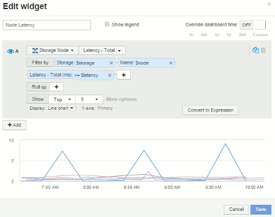

= Beispiel-Widget-Einstellungen für das Node-Dashboard
:allow-uri-read: 
:icons: font
:imagesdir: ../media/

[role="lead"]
Widget-Einstellungen für das Node-Dashboard mit Variablen, Beispiel.

Im Folgenden finden Sie die Einstellungen für die einzelnen Widgets im Dashboard des Storage-Node.

Node-Auslastung:

image:../media/nodeutilchart.gif[""] image:../media/nodeutiltable.gif[""]

Node-Latenz:

 image:../media/nodelatencytable.gif[""]

Storage-Pool-Auslastung:

image:../media/poolutilchart.gif[""] image:../media/poolutiltable.gif[""]

Durchsatz des Storage Pools:

image:../media/poolthroughputchart.gif[""] image:../media/poolthroughputtable.gif[""]

Volume-Latenz:

image:../media/vollatencychart.gif[""] image:../media/vollatencytable.gif[""]

Volume-IOPS:

image:../media/voliopschart.gif[""] image:../media/voliopstable.gif[""]
