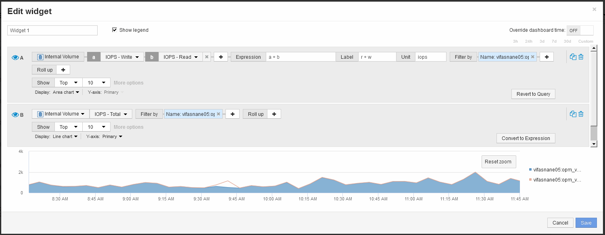

= Verwenden Sie einen Ausdruck, um alternative Metriken zu identifizieren
:allow-uri-read: 
:icons: font
:imagesdir: ../media/

[role="lead"]
Sie können Ausdrücke verwenden, um Metriken anzuzeigen, die nicht von der Web-Benutzeroberfläche bereitgestellt werden, wie z. B. die IOPS, die vom System-Overhead generiert werden.

== Über diese Aufgabe

Möglicherweise möchten Sie einen Ausdruck verwenden, um die gesamten IOPS anzuzeigen, die durch nicht-Lese- oder nicht-Schreibvorgänge generiert werden, z. B. Overhead-Vorgänge für ein internes Volume.

== Schritte

. Fügen Sie ein Widget zum Dashboard hinzu. Wählen Sie *Flächendiagramm*.
. Ändern Sie das Standardgerät in Internes Volume: Klicken Sie auf *Speicher* > *Internes Volume* > *IOPS Schreiben*
. Klicken Sie auf die Schaltfläche *in Ausdruck konvertieren*.
. Die Metrik *IOPS - Schreiben* befindet sich jetzt im Feld „`*a*`“ mit der alphabetischen Variable.
. Klicken Sie im Variablenfeld "`*b*`" auf *Auswählen* und wählen Sie *IOPS - Lesen*.
. Geben Sie im Feld *Ausdruck* *a + b* ein. Wählen Sie im Abschnitt *Anzeige* für den Ausdruck**Flächendiagramm**.
. Geben Sie im Feld *Filter by* den Namen des internen Volumes ein, das Sie analysieren.
. Das Feld *Beschriftung* kennzeichnet den Ausdruck. Ändern Sie die Bezeichnung in eine aussagekräftige Bezeichnung wie „`R + W IOPS`“.
. Klicken Sie auf **+Add**, um dem Widget eine Zeile für die gesamten IOPS hinzuzufügen.
. Ändern Sie das Standardgerät in Internes Volume: Klicken Sie auf *Speicher* > *Internes Volume* > *IOPS Total*
. Geben Sie im Feld *Filter by* den Namen des internen Volumes ein, das Sie analysieren.
+

+
Im Diagramm wird die IOPS insgesamt als Linie angezeigt. Im Diagramm wird die Kombination aus Lese- und Schreib-IOPS in Blau angezeigt. Die Lücke zwischen 9:30 und 9:45 zeigt I/O-Operationen (Overhead) ohne Lese- und Schreibzugriff.

