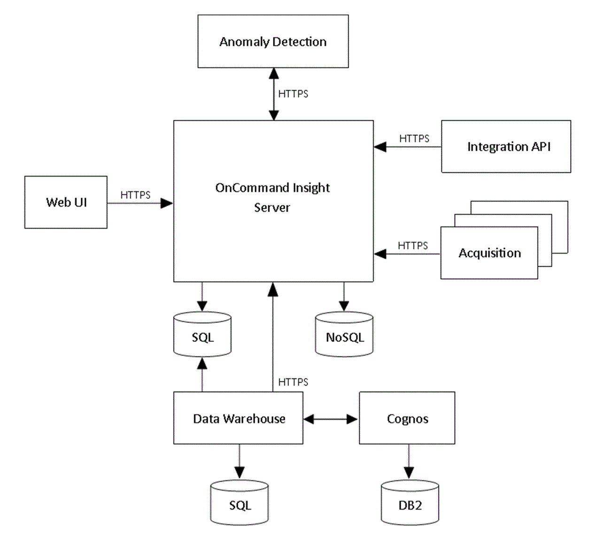

= Insight Architektur
:allow-uri-read: 
:icons: font
:imagesdir: ../media/

[role="lead"]
Eine typische Installation von OnCommand Insight umfasst Datenerfassung und Data Warehousing mit Berichten, die über eine webbasierte Benutzeroberfläche leicht zugänglich sind. Für sicherere Umgebungen kann die Erfassung über eine Fernbedienungseinheit erfolgen.

Das folgende Diagramm zeigt die wichtigsten Komponenten der Architektur von Insight:

* *OnCommand Insight-Server*
+
Der OnCommand Insight-Server enthält die wichtigsten Daten-Repositorys und Analysekomponenten. Der Server baut kontinuierlich eine End-to-End-Topologie der Umgebung auf, analysiert die Umgebung und generiert Warnmeldungen, wenn ein Vorfall oder eine Verletzung erkannt wird.

* *Akquisition*
+
Die Insight Collection Engine basiert auf einer oder mehreren Erfassungseinheiten. Jeder Insight-Server enthält eine lokale Erfassungseinheit und kann Remote-Erfassungseinheiten unterstützen. Jede Einheit ist ein Dienst, der im Netzwerk ausgeführt wird und über Module, die als _Datenquellen_ bezeichnet werden, Daten von Geräten im Rechenzentrum erfasst. Die von den Erfassungseinheiten erfassten Informationen werden dann zur Analyse an den Server gesendet.

+
Die Sammel-Engine ist so konzipiert, dass sie sehr modular und leicht gepatcht werden kann.

* *Integrations-API*
+
Eine API ermöglicht die Erfassung von Daten von externen Agenten. Integrationsdaten können über Abfragen und Widgets in der Web-Benutzeroberfläche angezeigt werden. Dashboards können „native“ Insight-Daten und Integrationsdaten enthalten. Sie können Filter, Rollups und Gruppierungen auf die Daten in diesen Dashboards anwenden.

* *Web UI*
+
Über die webbasierte HTML5-Benutzeroberfläche für Insight können Sie Datenquellen und Ihre Überwachungsumgebung einrichten, einschließlich Richtlinien, Schwellenwerte und Warnmeldungen. Anschließend nutzen Sie das UIAsset Dashboard und die Asset-Seiten im Internet, um potenzielle Probleme zu identifizieren und zu untersuchen. Sie können benutzerdefinierte Dashboards mit einer Vielzahl von Widgets erstellen, von denen jede große Flexibilität bei der Anzeige, Analyse und Dokumentation Ihrer Daten bietet.

* *Anomaly-Erkennung*
+
Anomalien sind Performance-veränderungsereignisse in der Applikationsinfrastruktur, die nicht den zuvor beobachteten und erwarteten Mustern entsprechen. Die Anomalieerkennung zielt auf die Infrastruktur, die eine Applikation bedient, ab und identifiziert Änderungen an Verarbeitungsmustern und -Verhaltensweisen. Diese zyklischen Verarbeitungsmuster umfassen historische „Ebbs und Flut“ in einer Workload-Performance während der Geschäftszeiten und außerhalb des Geschäftsbetriebs.

* *Data Warehouse*
+
Das OnCommand Insight Data Warehouse ist ein zentralisiertes Repository, das Daten von mehreren Insight Servern speichert und Daten zu einem gemeinsamen, mehrdimensionalen Datenmodell für Abfrage und Analyse transformiert.

+
Das OnCommand Insight Data Warehouse ermöglicht den Zugriff auf eine offene Datenbank mit mehreren Datentabellen, mit denen Sie benutzerdefinierte Kapazitäts- und Performance-Berichte generieren können, beispielsweise Chargeback-Berichte, Trendberichte mit Archivdaten, Verbrauchsanalysen und Prognoseberichte.

+
Das Data Warehouse konsolidiert und bereitet die Daten für die Berichterstellung für eine oder mehrere Installationen von Insight vor. Zu den Daten gehören Verlaufsdaten, Trends, Inventar, Chargeback, Showback und Datenpräsentationen, die eine langfristige Planung der Datacenter-Infrastruktur unterstützen.

* *Cognos*
+
Cognos ist die Reporting Engine für Insight, ein IBM Business Intelligence Tool, mit dem Sie vordefinierte Berichte anzeigen oder benutzerdefinierte Berichte erstellen können. In den Insight Berichten werden Berichte aus den Data Warehouse-Daten generiert.

+
[NOTE]
====
Wenn Sie Insight auf einem Linux-Server installieren, können Sie Cognos nur verwenden, wenn das Data Warehouse auf einem Windows-Server installiert ist. Informationen zur Installation des Data Warehouse unter Windows finden Sie im _OnCommand Insight Installationshandbuch für Microsoft Windows_.

====

