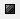

= Cognos-Speicher wird erhöht
:allow-uri-read: 
:icons: font
:imagesdir: ../media/

[role="lead"]
Bevor Sie die Data Warehouse-Datenbank wiederherstellen, sollten Sie die Java-Zuweisung für Cognos von 768 MB auf 2048 MB erhöhen, um die Zeit für die Berichterstellung zu verkürzen.

== Schritte

. Öffnen Sie ein Eingabeaufforderungsfenster als Administrator auf dem Data Warehouse-Server.
. Navigieren Sie zum `disk drive:\install directory\SANscreen\cognos\c10_64\bin64` Verzeichnis.
. Geben Sie den folgenden Befehl ein: `cogconfigw`
+
Das Fenster IBM Cognos Configuration wird angezeigt.

+
[NOTE]
====
Die Verknüpfung IBM Cognos Configuration verweist auf `disk drive:\Program Files\SANscreen\cognos\c10_64\bin64\cognosconfigw.bat`. Wenn Insight im Verzeichnis Programme (Leerzeichen zwischen) installiert ist, das als Standard anstelle von ProgramFiles (kein Leerzeichen) dient, wird der installiert `.bat` Die Datei funktioniert nicht. Klicken Sie in diesem Fall mit der rechten Maustaste auf die Anwendungsverknüpfung, und ändern Sie sie `cognosconfigw.bat` Bis `cognosconfig.exe` Um die Verknüpfung zu korrigieren.

====
. Erweitern Sie im linken Navigationsbereich *Environment*, erweitern Sie *IBM Cognos Services* und klicken Sie dann auf *IBM Cognos*.
. Wählen Sie *Maximum Memory for Tomcat in MB* und ändern Sie 768 MB auf 2048 MB.
. Klicken Sie in der Symbolleiste IBM Cognos Configuration auf image:../media/cognos-save-icon.gif[""](Speichern).
+
Es wird eine Informationsmeldung angezeigt, die Sie über die Aufgaben informiert, die Cognos ausführt.

. Klicken Sie Auf *Schließen*.
. Klicken Sie in der Symbolleiste IBM Cognos Configuration auf (Stopp).
. Klicken Sie in der Symbolleiste IBM Cognos Configuration auf image:../media/cognos-start-icon.gif[""](Start).

