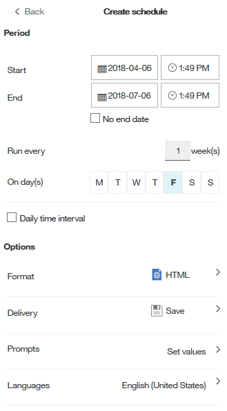

= Anpassen des Ausgabeformats und der Bereitstellung eines Berichts
:allow-uri-read: 
:icons: font
:imagesdir: ../media/

[role="lead"]
Sie können das Format und die Bereitstellungsmethode von Berichten anpassen.

== Schritte

. Öffnen Sie das OnCommand Insight-Berichtsportal, wählen Sie den Bericht aus, den Sie anpassen möchten, und klicken Sie auf *[...]*.
+
image::../media/run-report.gif[Bericht ausführen]

. Klicken Sie Auf *Eigenschaften* > *Zeitplan*
+

. Sie können folgende Optionen festlegen:
+
** *Zeitplan*, wenn Sie Berichte ausführen möchten.
** *Format* die Berichtausgabe.
** *Lieferung* Drucken, speichern oder senden Sie den Bericht per E-Mail.
** *Sprachen* definiert die Sprache, in der der Bericht geliefert wird.

. Klicken Sie auf *Erstellen*, um den Bericht anhand der von Ihnen getroffene Auswahl zu erstellen.

